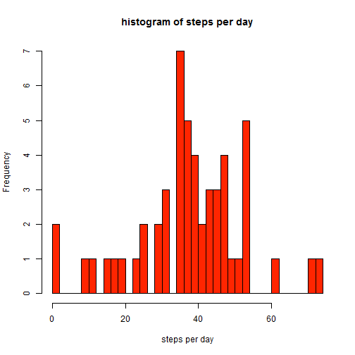
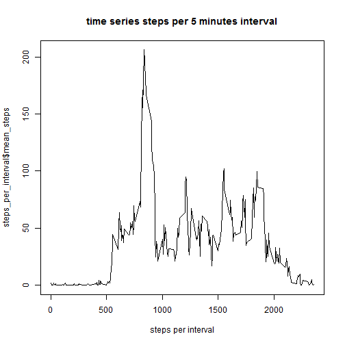
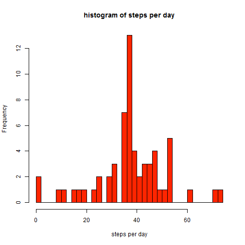

# Reproducible Research: Peer Assessment 1
## Ariel Israel, Jul 2013

## Loading and preprocessing the data

```r
library(data.table)
```

```
## Warning: package 'data.table' was built under R version 3.0.3
```

```r
data<-fread('d:/datasets/repdata/activity.csv')
```

## What is mean total number of steps taken per day?

```r
steps_per_day<-data[,list(mean_steps=mean(steps,na.rm=T)),by='date']
hist(steps_per_day$mean_steps,nclass=50,col='#ff2500',xlab='steps per day',main='histogram of steps per day')
```

 

```r
steps_summary=summary(steps_per_day$mean_steps)
```
* mean steps per day: 37.4
* median steps per day: 37.4

## What is the average daily activity pattern?

```r
steps_per_interval<-data[,list(mean_steps=mean(steps,na.rm=T)),by='interval']
plot(steps_per_interval$interval,steps_per_interval$mean_steps,xlab='steps per interval',main='time series steps per 5 minutes interval',type='l')
```

 

```r
interval_max=with(steps_per_interval,interval[which.max(mean_steps)])
```
* 5 minutes interval containing the maximum number of steps: 835


## Imputing missing values
* missing values in the dataset: 2304
## filling in with the missing values per day

```r
# replace missing values with the median for the interval
data_imputed=data
for (i in 1:nrow(data)) {
    if (is.na(data$steps[i])) {
        data_imputed$steps[i]=steps_per_interval$mean_steps[steps_per_interval$interval==data$interval[i]]
    }
}
steps_per_day_imputed<-data_imputed[,list(mean_steps=mean(steps,na.rm=T)),by='date']
hist(steps_per_day_imputed$mean_steps,nclass=50,col='#ff2500',xlab='steps per day',main='histogram of steps per day')
```

 

```r
steps_summary_imputed=summary(steps_per_day_imputed$mean_steps)
```
* missing values in the imputed dataset: 0
* mean steps per day: 37.4
* median steps per day: 37.4


## Are there differences in activity patterns between weekdays and weekends?
